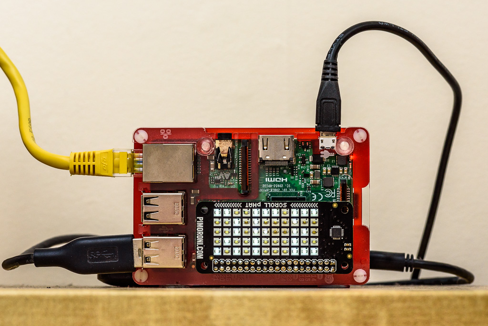

# PiServerStatus Daemon

This is a simple daemon which displays several system stats, 
as well as the clock and local weather on the Pimoroni Scroll pHAT. 

## Prerequisites

To be able to run PiServerStatus Daemon, you must have Pimoroni Scroll pHAT.
For more information, check https://shop.pimoroni.com. 

`PiServerStatusd` uses the following modules:
* scrollphat (to handle the Scroll pHAT)
* psutil (to display system statistics)
* pyowm (to display local weather)
* pydaemon (UNIX daemon implementation in pure python - **READ BELOW**) 

### Installation or required modules

The `psutil` and `pyowm` are published on https://pypi.org/, therefore the installation
of these two modules is as straightforward as:

```bash
$ sudo pip3 install psutil pyowm
```

To install `pydaemon`, do the following:

1. Clone the repository: https://github.com/mkrzysztofowicz/pydaemon.git

    ```bash
    $ git clone https://github.com/mkrzysztofowicz/pydaemon.git
    ```

2. Install the module

    ```bash
    $ cd pydaemon/
    $ python3 setup.py sdist
    $ pip3 install dist/pydaemon-0.1.tar.gz
    ```

## Installation of PiServerStatus Daemon

1. Clone the repository

    ```bash
    $ git clone https://github.com/mkrzysztofowicz/piserverstatusd.git`
    ```
    
2. Install files to their locations

    ```bash
    $ cd piserverstatusd/
    
    # copy the daemon file to /usr/local/bin and make it executable
    $ sudo cp piserverstatusd.py /usr/local/bin
    $ sudo chmod 755 /usr/local/bin/piserverstatusd.py
    
    # make a symbolic link, so we can always run piserverstatusd
    $ sudo ln -s /usr/local/bin/piserverstatusd.py /usr/local/bin/pyserverstatusd
    
    # place configuration and systemd service files in /etc
    $ sudo cp piserverstatusd.conf /etc
    $ sudo cp piserverstatusd.service /etc/systemd/system
    ```

3. Enable and start the daemon

    ```bash
    $ sudo systemctl enable piserverstatusd
    $ sudo systemctl start piserverstatusd
    ``` 

## How does it look like




